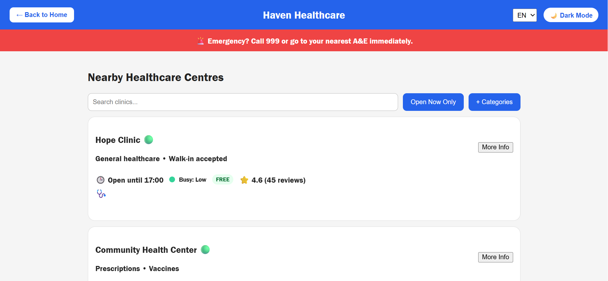
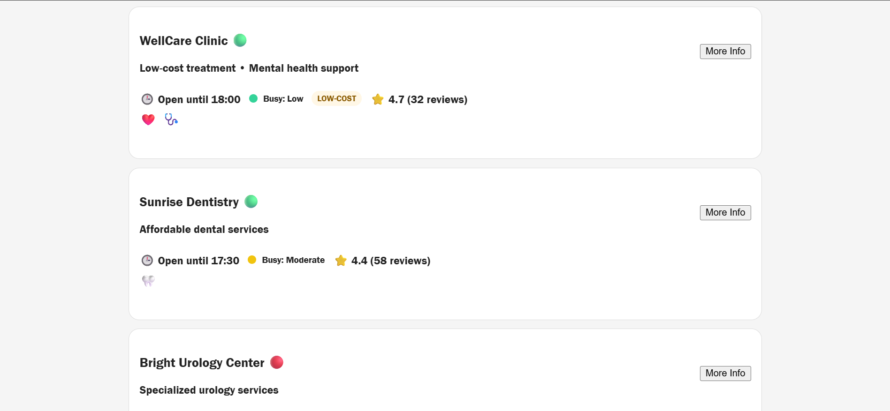
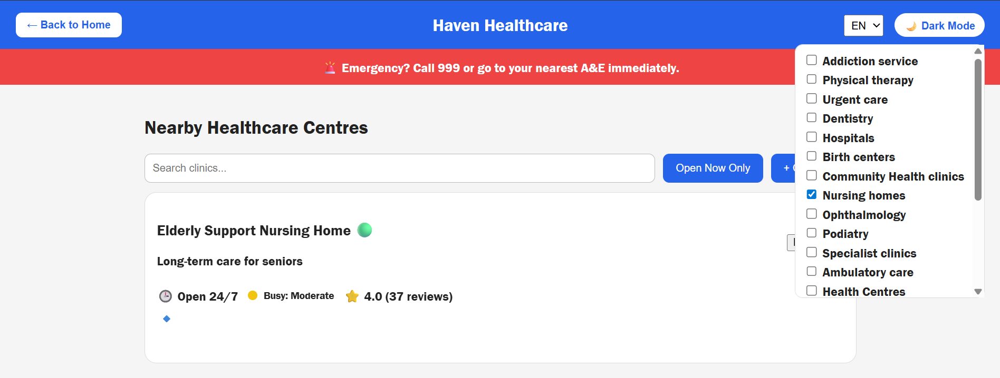
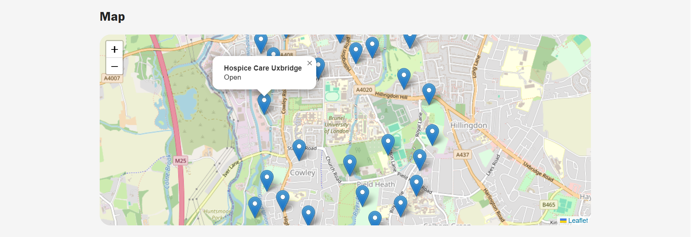
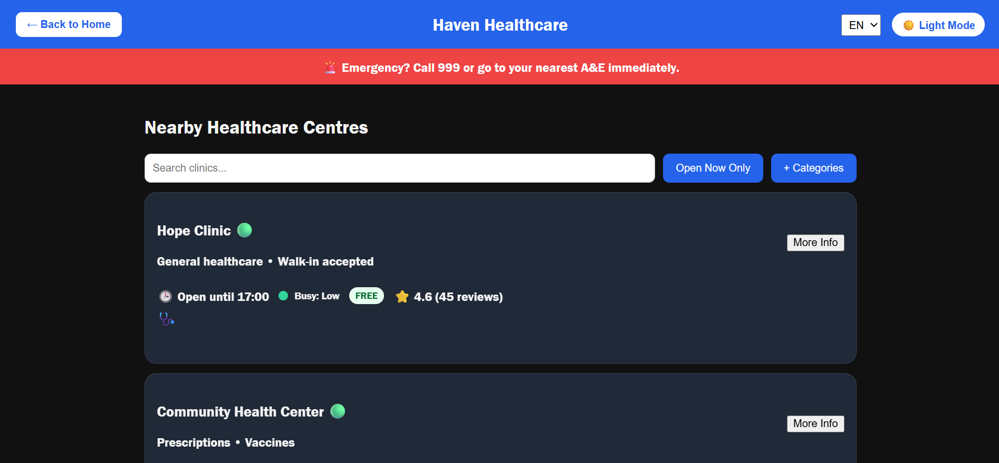

# Healthcare Support Web Platform

## Live Demo 
https://swastiktarun06.github.io/healthcare-support-platform/

## Overview
This project is a responsive front-end healthcare support platform designed to centralise access to essential services for vulnerable communities. 

The platform was developed using HTML, CSS, and Vanilla JavaScript, with integrated Leaflet.js mapping to display real clinic locations. It focuses heavily on accessibility, usability, and intuitive UI design.

The project demonstrates practical front-end development skills, DOM manipulation, interactive filtering logic, third-party library integration, and user-centred design principles.

## Features
- Interactive clinic cards  
- Search and category filtering  
- Leaflet.js map integration with real clinic locations  
- Dark mode toggle  
- Accessibility-focused UI design  

## Technologies Used
- HTML5  
- CSS3  
- JavaScript (Vanilla JS)  
- Leaflet.js  

## Key Learning Outcomes
- Front-end architecture and modular JavaScript  
- UI/UX design and accessibility considerations  
- Integration of external libraries  
- Structured debugging and iterative testing

## Screenshots

### Homepage

### Clinic Cards & Filters

### Search Filter

### Interactive Map

### Dark Mode

